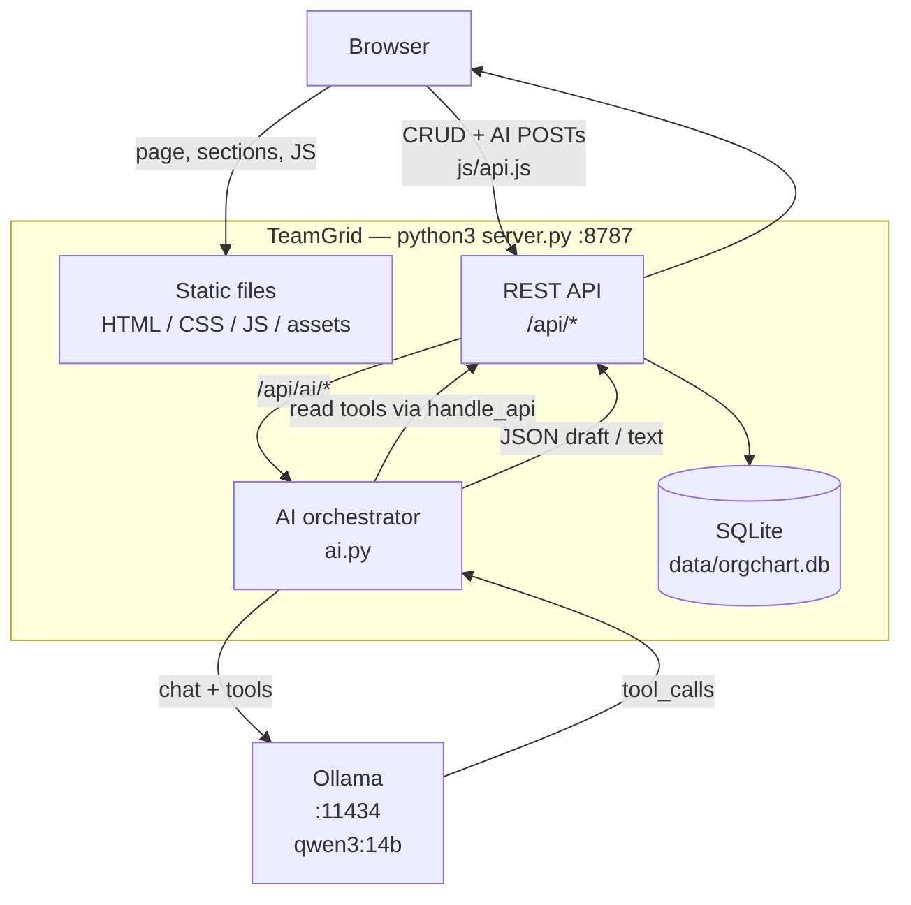
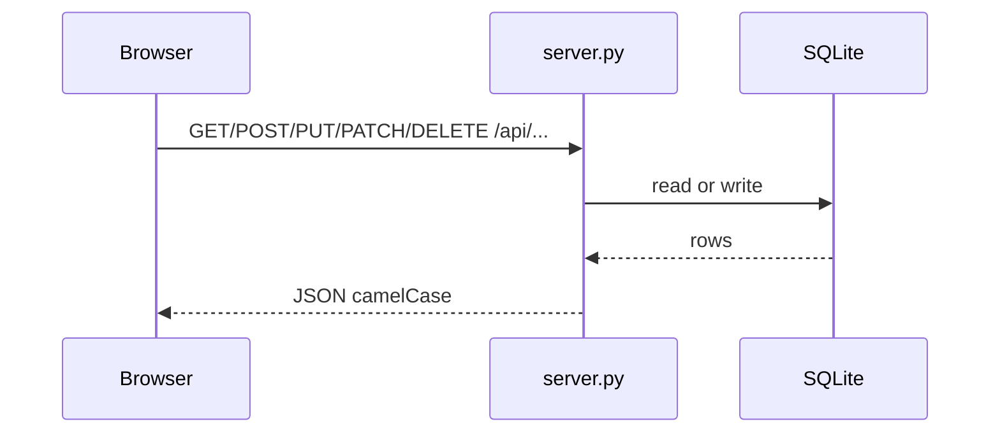
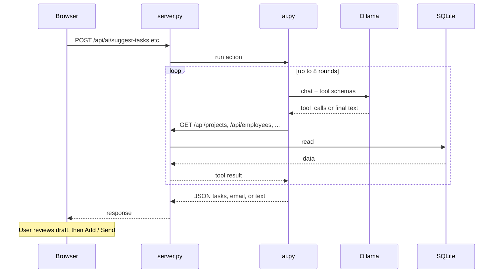

# TeamGrid

Local org-chart, directory, and project workspace. One Python process serves the UI, a SQLite REST API, and an Ollama-backed AI agent that reads the same APIs as tools.

## Quick start

```bash
# Terminal 1 — Ollama (model must be available)
ollama pull qwen3:14b
ollama serve

# Terminal 2 — TeamGrid
python3 server.py
```

Open [http://127.0.0.1:8787/](http://127.0.0.1:8787/).

| Setting | Default | Override |
| --- | --- | --- |
| App / API port | `8787` | `PORT=9000 python3 server.py` |
| Ollama host | `http://127.0.0.1:11434` | `OLLAMA_HOST=...` |
| Ollama model | `qwen3:14b` | `OLLAMA_MODEL=...` |

First launch imports `data/seed.json` into `data/orgchart.db`. Later edits persist in the database.

API reference: [TOOLS.md](TOOLS.md).

## Architecture



### What each piece does

| Piece | Role |
| --- | --- |
| Browser UI | Shell in `orgchartdirectory.html`; sections load from `sections/`; logic in `js/app.js`; HTTP client in `js/api.js`. |
| `server.py` | Serves static files and the REST API; seeds SQLite on first run. |
| `data/orgchart.db` | Source of truth for people, projects, tasks, meetings, evaluations, conversations. |
| `ai.py` | Agent loop: prompts Ollama, runs read-only API tools, returns structured JSON. |
| Ollama | Local LLM. Required for Suggest tasks, Draft email, Ask AI, timeline summary, and daily summary. |

### CRUD data flow



Examples: edit a person (`/api/employees`), replace project tasks (`/api/projects/:id/tasks`), start an inbox thread (`/api/conversations`).

### AI agent flow

AI actions never write tasks or conversations themselves. The model only **reads** via tools; the UI still confirms drafts (Add task / Send message).



| UI action | Endpoint | Typical result |
| --- | --- | --- |
| Suggest tasks | `POST /api/ai/suggest-tasks` | Draft parent tasks (not saved until Add) |
| Draft email | `POST /api/ai/draft-email` | Opens Inbox compose, prefilled |
| Ask AI | `POST /api/ai/chat` | Answer text |
| Timeline summary | `POST /api/ai/timeline-summary` | Summary text |
| Daily summary | `POST /api/ai/daily-summary` | Dashboard summary text |

Read tools the agent may call: list/get employees, notes, checklist, list/get projects, evaluations, conversations.

## Layout

```
OrgChart/
├── server.py              # static + REST + AI routes
├── ai.py                  # Ollama tool-calling agent
├── orgchartdirectory.html # shell, styles, modals
├── sections/              # Organisation, Projects, Inbox, Overview
├── js/
│   ├── loader.js          # injects sections, then api.js + app.js
│   ├── api.js             # fetch client for /api
│   ├── app.js             # UI state and rendering
│   └── sidebar.js
├── assets/                # status GIFs / JPGs for task progress
├── data/
│   ├── seed.json          # first-run seed
│   └── orgchart.db        # live DB (gitignored)
├── TOOLS.md               # API documentation
└── README.md
```

## Workspace areas

- **Organisation** — org chart, directory, people board, workload, evaluations
- **Projects** — projects list, task board, timeline, calendar; tasks with progress bands and meeting log
- **Inbox** — threaded messages about tasks, projects, topics, evaluations
- **Overview** — dashboard stats and AI daily summary
